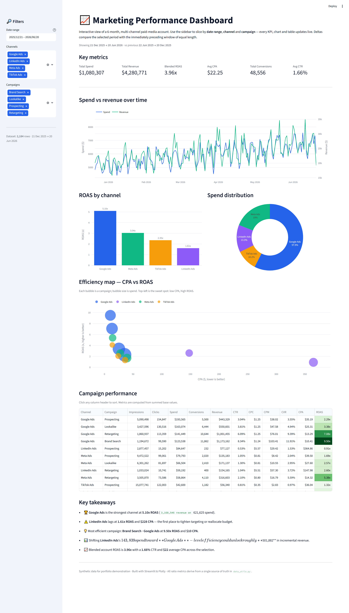

# 📈 Marketing Performance Dashboard

An interactive, filterable **marketing / ad-performance dashboard** built with
[Streamlit](https://streamlit.io) and [Plotly](https://plotly.com/python/).
It turns a 6-month, multi-channel paid-media dataset into a live analytics app:
slice the data by **date range**, **channel** and **campaign**, and every KPI,
chart and table updates instantly.

> Unlike a static PDF/HTML report, this is a **live data app** a stakeholder can
> explore on their own — drill into a single channel, compare campaign
> efficiency, or zoom into a specific date window.

---

## ✨ Features

- **Six KPI cards** — Total Spend, Total Revenue, Blended ROAS, Avg CPA, Total
  Conversions and Avg CTR — each with a **period-over-period delta** (the
  selected window vs. the immediately preceding window of equal length).
- **Interactive Plotly charts** (hover, zoom, pan), all reacting to the filters:
  - Spend vs. revenue over time (**dual-axis** line)
  - **ROAS by channel** (bar)
  - **Spend distribution** by channel (donut)
  - **CPA vs. ROAS efficiency map** (bubble scatter, bubble size = spend)
- **Sortable campaign table** with every base and derived metric.
- **Auto-generated "Key Takeaways"** — best/worst channel, most efficient
  campaign and a budget-reallocation hint, all computed from the *filtered* data.
- **Consistent metrics by design** — every ratio (CTR, CPC, CPA, CVR, ROAS, CPM)
  is computed in one place from summed base metrics, so the cards, charts and
  table can never disagree.

---

## 🖼️ Screenshot

> _Add a screenshot here once the app is running locally._

```
docs/screenshot.png
```



---

## 🧱 Tech stack

| Layer            | Tool                          |
| ---------------- | ----------------------------- |
| App framework    | Streamlit                     |
| Charts           | Plotly Express / Graph Objects |
| Data wrangling   | pandas, NumPy                 |
| Language         | Python 3.9+                   |

---

## 📂 Project structure

```
marketing-dashboard/
├── generate_data.py      # Reproducible synthetic ad-campaign data generator
├── data_utils.py         # Loading, filtering & metric calculation (single source of truth)
├── app.py                # Streamlit dashboard (UI + charts)
├── requirements.txt      # Python dependencies
├── README.md
├── .gitignore
├── .streamlit/
│   └── config.toml       # Brand theme (committed; secrets.toml is git-ignored)
└── data/                 # Generated CSV lives here (created on first run)
    └── ad_campaigns.csv
```

### How the data model stays consistent

`generate_data.py` only ever emits the **five additive base metrics**
(`impressions`, `clicks`, `spend`, `conversions`, `revenue`). Every **ratio
metric** is derived later in `data_utils._derived_from_sums()` from *summed*
base metrics:

```
CTR  = clicks / impressions          CVR  = conversions / clicks
CPC  = spend / clicks                CPA  = spend / conversions
CPM  = spend / impressions * 1000    ROAS = revenue / spend
```

Because both the KPI cards and the grouped charts call the *same* function,
a channel's CTR is always `sum(clicks)/sum(impressions)` for that channel and
the blended CTR is the same formula over the whole selection — no averaged
ratios, no inconsistent totals.

---

## 🚀 Run locally

You'll need **Python 3.9+**.

```bash
# 1. (from the repo root) enter the project
cd marketing-dashboard

# 2. create & activate a virtual environment
python -m venv .venv
# Windows
.venv\Scripts\activate
# macOS / Linux
source .venv/bin/activate

# 3. install dependencies
pip install -r requirements.txt

# 4. (optional) pre-generate the dataset — the app also does this automatically
python generate_data.py

# 5. launch the dashboard
streamlit run app.py
```

The app opens at <http://localhost:8501>. On first run it generates
`data/ad_campaigns.csv` automatically if it doesn't already exist.

---

## ☁️ Deploy to Streamlit Community Cloud

Streamlit Community Cloud hosts the app for free directly from a GitHub repo.

1. **Push to GitHub.** Commit this project to a public (or private) GitHub
   repository. If `marketing-dashboard/` lives inside a larger repo, that's
   fine — you'll point Streamlit at the subfolder's `app.py` in step 4.
2. **Sign in.** Go to <https://share.streamlit.io> and sign in with GitHub.
3. **New app.** Click **"Create app" → "Deploy a public app from GitHub"**.
4. **Configure:**
   - **Repository:** `your-username/your-repo`
   - **Branch:** `main`
   - **Main file path:** `marketing-dashboard/app.py`
     _(use the full path if the project is in a subfolder)._
5. **Deploy.** Streamlit installs `requirements.txt` and launches the app.
   The dataset is generated on first load, so no data files are required in the
   repo. You'll get a shareable `*.streamlit.app` URL.

**Notes**
- Keep `requirements.txt` at the **same level as `app.py`** so Streamlit Cloud
  finds it.
- The committed `.streamlit/config.toml` (theme) is applied automatically.
  Never commit `.streamlit/secrets.toml` — it's git-ignored for that reason.

---

## 🔁 Regenerating the data

The dataset is fully reproducible (fixed NumPy seed). To regenerate it:

```bash
python generate_data.py
```

Tweak the channel/campaign economics, date range or noise levels at the top of
`generate_data.py` to model a different account.

---

## 📜 License

Released under the [MIT License](LICENSE) for portfolio and educational
purposes. The dataset is entirely synthetic.
